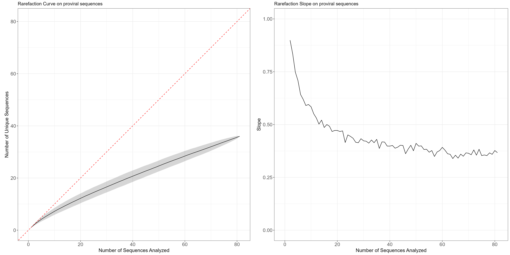

# Rarefaction curve for sequence clonality

#### Vivek Hariharan, 2024-12-17

This R script is used to generate a rarefaction curve for sequence clonality based on **nucleotide** sequences.

The idea behind this code is that sequences are first randomized, and then the number of unique sequences is counted as a function of the number of sequences sampled. This process is repeated 100 times (or greater, depending on the user specification) to get a mean and standard deviation for the number of unique sequences as a function of the number of sequences sampled. 

## How to use

Either clone or fork this repository and run the R script in any R environment.

## Input

The input is a pre-aligned FASTA or FAS file where every sequence is the same length.

## Output

The output is a figure composed of two subfigures. The first figure is the rarefaction curve that shows the number of unique sequences as a function of the number of sequences sampled. A dashed, red line is also plotted to show y=x, as if every sequence was unique. The black ribbon around the curve represents the standard deviation of the 100 repetitions.
The second figure is the slope of the rarefaction curve. We expect the slope to decrease to zero as the number of sequences sampled increases. 


## Example

The following is an example output of the script. 


## Dependencies

This script requires the following R packages: `ggplot2` and `Biostrings`. If you do not have these packages installed, you can install them using the following commands in the R terminal:

```R
install.packages("ggplot2")
install.packages("Biostrings")
```

You can also install these packages through BiocManager:

```R
if (!requireNamespace("BiocManager", quietly = TRUE))
    install.packages("BiocManager")
BiocManager::install("Biostrings")
```

## Future work

In the future, I plan to add more features to this script and embed it as a function in a package. I also plan to add more options for the user to customize the plot.

## Citation

Please cite this repository if you use or fork this repo.

## Acknowledgements

This script was inspired by [Dr. Robert Siliciano at Johns Hopkins University](https://gradimmunology.med.som.jhmi.edu/siliciano/). 
